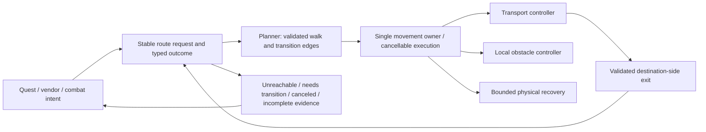

# Evidence-led audit: baseline, findings, and repair gates

Source baseline: `63112d57a373c1186cee880f98dab65245a214e1` (master). Captured with private Actions run `34690090313`; the source archive SHA-256 is `e481f069af1318c7e4969b8887d0371c81f8cd090bc7eb3aebac2d0c2b77cbc0`.

## Status and scope

This is a committed evidence baseline, not a declaration that every quest, class, or transport works. The complete tracked corpus was obtained and the three audit instructions were read completely. All 62 runtime logs were processed; all 1,541 C# files underwent syntax extraction; all 4,335 global quest records, 33,134 spawn points, and 106 zone files underwent static data checks. Selected high-risk chains were manually traced across owners. Type-bound call resolution, every profile's operational semantics, all-spec decision validation, native mesh inspection, and live-game acceptance remain open gates. No behavior rewrite is authorized by syntax counts alone.

The audit tools distinguish EXTRACTED source facts, INFERRED explanations, and AMBIGUOUS references. Missing information is retained, not replaced by guessed coordinates, map IDs, target identity, or causes. Syntax calls are references, not resolved runtime callees. Raw event totals are not defect counts.

## Executive findings

| ID | Finding | Confidence and boundary |
|---|---|---|
| B01 | A clean Windows checkout initially fails on long captured profile paths. With Git long paths enabled, the unchanged host build reports 2,364 errors and 119 warnings, including archived runtime code compiled into the host. | Confirmed in Actions runs 34690236255 and 34690526819. Build/deployment ownership. |
| L01 | SpellManager adds another bot-start handler whenever TreeRoot starts it. | Confirmed source; the complete 13-start log sequence matches handler growth exactly. |
| N01 | Exhausted partial paths enter generic stuck recovery even when the destination is on another floor. | Confirmed control flow and Thunder Bluff log behavior; missing mesh geometry prevents attribution solely to mesh or lift selection. |
| N02 | Lift discovery requires both landings from an existing mesh path and orders candidates by proximity rather than whole-route cost. | Confirmed policy; a partial path without an upper landing cannot establish a safe crossing. |
| N03 | Once the controller reaches Boarding, a subsequently false boardingPathSafe does not consistently prevent another MoveToBoard decision. | Confirmed source predicate; deterministic production-policy reproduction required before repair. |
| N04 | Stop can interrupt native injection while recovery is still issuing movement. Duration-based movement already uses a queued deadline, not a duration-long sleep. | Confirmed trace and current source; cancellation and queued command ownership require separate tests. |
| Q01 | Quest recovery data fingerprints hash path/size/mtime rather than file contents. | Confirmed source; same-size, same-mtime edits can be missed and relocation can invalidate unchanged content. |
| Q02 | Explicit Great Lift/Freewind knowledge is inserted for objective profile work, not centrally for vendors, pickup, and turn-in routes. | Confirmed profile structure; central navigation should own validated transitions. |
| C01 | Shared Singular Cast evaluates requirements before validating its selected target. Some later actions resolve the target again. | Confirmed source; historical Ret null-target traces support prioritization but are not proof that all old lambda identities still map to current code. |
| C02 | Ret target-count gates suppress Crusader Strike when Divine Storm is known at 4+ targets, even without checking Divine Storm readiness. | Confirmed predicate; performance magnitude and game-correct priority require decision and combat traces. |
| P01 | Slow plugin/root/path samples are frequent, but logs contain only thresholded samples. | Confirmed observation; cannot infer all-tick p95 or a measured improvement from these warnings alone. |

## Corrections to the seeded hypotheses

### The 49-yard lift argument mixes two distance definitions

`Styx/WoWInternals/WoWObjects/WoWObject.cs:203-225` distinguishes 3D Distance from Distance2D. `DefaultStuckHandler.LogNearestGameObject` logs Distance. `MeshNavigator.ShouldPreferNearbyElevator` (`Styx/Logic/Pathing/MeshNavigator.cs:1692-1708`) uses horizontal distances and a live transport transform. Therefore the logged 49.78 yards cannot, by itself, prove rejection by the 35-yard horizontal gate. The observed platform coordinates and animated transform were not recorded together. Widening the radius based only on this comparison is not justified.

The early captured player-to-Grod horizontal separation is approximately 219.50 yards, which also exceeds that helper's 120-yard endpoint gate if that exact destination was active then. The later partial-path endpoint is a different position. These observations must not be merged into one simultaneous geometry snapshot.

### The spellbook totals are cumulative

The newest log has 13 starts. Per-start spellbook rebuild counts are `[1,2,3,4,5,6,7,8,9,10,11,12,13]`; per-start repeated Lua-subscription messages are `[0,1,2,3,4,5,6,7,8,9,10,11,12]`. Totals are 91 and 78 respectively, not 91 and 78 at the final restart. The final restart at 18:22:10.515 produces 13 rebuilds and 12 subscription messages. There is one Initialize message per start.

`Styx/Logic/BehaviorTree/TreeRoot.cs:116-144` installs its handler once, then calls Initialize on each start. `Styx/Logic/Combat/SpellManager.cs:1083-1121` adds another handler inside Initialize and refreshes in both Initialize and that handler. No ordinary Shutdown caller was found. Merely replacing += with -=/+= would still leave duplicate refresh ownership; a repair must prove one owner and one refresh per start, first-start Lua subscription, and symmetric teardown.

### Timed movement is already queued

`Styx/WoWInternals/WoWMovement.cs:554-558` starts movement, then schedules a stop deadline. It does not sleep for the requested duration. The 18:22:01 stop exception enters `GreenMagic.ExecutorRand.WaitForInjection` through NativeMove, not a duration timer. Replacing this with another timer abstraction would miss the demonstrated blocking boundary. The schedule also needs overlapping-direction, explicit cancellation, and stale-command tests; those are separate hypotheses.

### Historical logs do not establish exact deployed source identity

The September 5 iterator storm emits an older message without the concrete composite type. Current `TreeSharp/Composite.cs:42-44` includes the type. Treat the 3,902 records as historical failure evidence, not proof that today's precise iterator path is unchanged. Compiler-generated Ret lambda names are similarly unstable identifiers.

## Corpus and deployment census

The captured tree contains 3,876 files, including 1,541 C# files, 1,778 XML files, 113 JSON files, and 62 logs. Main source is outside runtime-snapshot. Installed extension source remains evidence and may be canonical only where no other source exists. The host SDK project excludes Tools and output but not runtime-snapshot (`CopilotBuddy.csproj:39-54`); this is a reproduced build boundary defect.

`output.zip` contains 1,111 files (18,145,730 uncompressed bytes). Comparing overlapping package paths with runtime-snapshot found 217 byte-identical files and 312 differing files. The archive also includes nested development metadata such as .git entries. It is not an authoritative, clean deploy artifact and must not be blindly copied over the snapshot or republished. The audit did not execute packaged binaries or inspect credential values.

The Wholesome regression project has compile includes escaping the checkout; routine compilation tests search installed Routines folders instead of the tracked snapshot. A passing test from one developer installation is not yet a reproducible clean-checkout result.

Missing: multi-gigabyte mmaps, a running 3.3.5a client, native collision/attachment observations, and verified Mesa landing geometry. These gaps block live safety and optimal-route acceptance, not static investigation.

## Runtime baseline

All 62 logs: 20,934,843 bytes; 218,114 physical lines; 208,037 parsed records. Literal line counts:

| Signal | Matching lines |
|---|---:|
| Slow bot root | 50,477 |
| Slow plugin | 8,591 |
| Exception | 5,364 |
| NullReferenceException | 1,247 |
| Building spell book | 880 |
| Nav MoveTo failed | 345 |
| partial=True | 338 |
| We are stuck | 293 |
| Skipped N path nodes | 365 |
| Mount-up request cancelled | 98 |
| PathGenerationFailed | 88 |
| Slow path generation | 44 |
| ThreadInterruptedException | 24 |

Blackspot is 129 case-sensitive matching lines, or 203 case-insensitive matching lines. The seed's 203 is reproducible under the latter definition. The count of files with navigation activity depends on the pattern set; the seed's 36 should not be repeated without its definition.

Conservative navigation grouping uses capture, restart, clock segment, map, POI, destination, a fixed 30-yard 3D anchor, and a 30-second gap. It yields 420 investigation buckets, only 12 with all spatial context available. Missing-map/location records remain unresolved singletons. These are not 420 unique bugs. Exception grouping by type, first three frames, restart and a five-second gap yields 362 five-second/signature episodes, including 218 NRE episodes; this is a grouping rule, not a causal verdict.

### Warning-conditioned latency, milliseconds

| Samples | n | p50 | p95 | p99 | max |
|---|---:|---:|---:|---:|---:|
| All emitted slow bot-root warnings | 50,477 | 248 | 1,080 | 2,808 | 10,507 |
| Questing / Sell / not in combat | 1,956 | 260 | 559 | 1,233.25 | 4,438 |
| AutoEquip2 slow warnings | 4,239 | 220 | 578 | 7,499 | 7,558 |
| Slow path warnings | 44 | 1,123.5 | 3,094.35 | 3,181.56 | 3,185 |

Percentiles use sorted linear interpolation at (n-1)*p. They describe warning samples, not the uncensored population. No all-tick latency target or improvement claim can be verified until the same full-cadence instrumentation captures before and after. AutoEquip2's ten-second pulse gate and synchronous Lua/bag work are visible at `runtime-snapshot/Plugins/AutoEquip2/AutoEquip.cs:61-82,90-112,146-190`; no dominant inner operation has yet been isolated by measurement.

## Thunder Bluff cross-layer trace

1. Questing selects the Grod vendor destination (-1152.76,71.41,145.87).
2. At 18:20:46.675, stuck detection reports (-1350.26,167.19,48.68); at .709 it logs Mesa Elevator entry 4171 at 49.78 3D yards.
3. At 18:21:20.653 a synchronous path query loads 330 tiles and takes 1,041 ms; the resulting route exhausts at 90/90, partial=True.
4. Through 18:21:25-18:21:56, two-point partial paths exhaust beneath the destination and generic recovery continues.
5. Source chain: POI movement -> Navigator/Flightor -> MeshNavigator.MoveToCore -> CompletePathOrRecover -> DefaultStuckHandler.Unstick -> WoWMovement.NativeMove. Shortcut creation runs on path regeneration and requires safe source/destination mesh landings (`MeshNavigator.cs:1611-1765`).
6. Stop at 18:22:01 interrupts injection; a subsequent recovery command is still visible before worker exit.

Competing explanations: missing/disconnected destination mesh; missing lift exit samples; moving transform unavailable; horizontal/vertical preference gates; a reachable ramp outside the heuristic; stale route/POI; delayed pulses. The logs prove non-handoff and repeated recovery, not which individual discovery gate rejected the platform. Capture all candidate rejection reasons, 3D and 2D distances, both transforms, landing samples, mesh tile/poly IDs, route ID and query costs to separate them.

## Quest coverage and ownership

Static checks cover every one of the 4,335 unique global quest IDs and all 33,134 spawn points. Objective types: 1,866 KillMob; 1,751 TurnInOnly; 1,364 CollectItem; 777 CollectFromGameObject. No duplicate quest IDs, unsupported objective type names, or nonfinite spawn coordinates were found by these checks.

Data-gap records: 1,636 objectives without corresponding spawn entries; 110 giver/ender relations without spawns; 112 quests without giver relations; 103 without ender relations; 397 external prerequisite references; two relations to quests outside the global table. These categories overlap. A missing giver can be legitimate for item-started or scripted quests. Do not delete prerequisites or blacklist quests solely from these checks.

The 106 zone files contain 4,213 quest references with 46 differences from global records: 45 changed records and one ID absent globally. DataLoader currently loads the global file. Choose a source of truth and review each difference before changing live quest data; automatic union may restore obsolete or unsupported objectives.

Preserved counter-evidence: QuestScheduler deliberately treats partial paths as unknown reachability rather than definitely unreachable (`QuestScheduler.cs:1040-1109`); Wholesome endpoint failure matching includes Z tolerance and fresh navigation evidence; transport state can suspend progress sampling (`WholesomeAutoQuest.cs:1600-1787`). These are protections, not defects to remove.

ProfileBuilder inserts Freewind/Great Lift guards in objective generation, while pickup/turn-in/vendor routes use other owners. A robust solution moves validated transition knowledge into route planning and carries typed failures back to the active quest attempt. A transport wait must not independently count as quest failure, rotate a hotspot, add a global blacklist and trigger physical unsticking.

## Singular coverage and Retribution

All class source underwent syntax extraction. Behavior-annotated method counts: DeathKnight 14, Druid 17, Hunter 13, Mage 15, Paladin 22, Priest 14, Rogue 23, Shaman 24, Warlock 21, Warrior 37. These counts show discovery candidates, not successful runtime composition or correct rotations.

For every supported spec and Normal/Instance/Battleground context, compilation, pull/combat/heal/rest/pre-combat/combat-buff/death composition, spell/level/talent/glyph validity, resource/proc state, defensives, targeting, movement cooperation, and golden decisions remain explicit scorecard gates. There is no all-spec PASS. Class-specific mechanics must not be inferred from later-expansion comments.

Ret priority findings: active four-target gates for Divine Storm/Crusader Strike; overlapping Heal/Pull/Combat annotations; duplicated seal policy; predicates dereferencing CurrentTarget; hard-cast Exorcism policy ignoring supplied melee and auto-attack inputs. The existing Exorcism test explicitly requires melee hard-casts. Altering a test to match a preferred rotation is not evidence of increased damage. Tests must cover level 33 and 80, unavailable abilities, GCD/cooldown/LOS rejection, proc ownership, movement, mana, target lifespan and target loss. Record chosen and rejected actions, idle GCDs, failed casts and melee uptime before claiming DPS improvement.

## Target architecture and alternatives

Route states: following; waiting for path; local detour; acquiring vertical transition; approaching; boarding; riding; exiting; physical stuck; unreachable; canceled/safe escalation. Every transition needs route/intent/generation ID, reason, position, map, destination, partial/index/count, Z gap, selected transport, blackspot version, recovery attempt and tick cost.

The efficient route is not necessarily the nearest lift. Compare validated walking approach + expected dock wait + ride + supported exit + onward route, with confidence and failure penalties. Unknown landing geometry is not a traversable edge. Registry metadata can complement generic observation, but only with validated map/entry/dock identity; never fabricate Mesa docks from a moving object's instantaneous location.

Rejected alternatives: radius-only Mesa patch; blanket 'all partial paths are unreachable'; replacing an existing movement timer without tracing native waits; global quest blacklisting on one route failure; one monolithic navigation/all-class rewrite; background game-object access without thread-affinity proof.

## Staged repair and validation

| Stage | Scope and required reproduction | Gate |
|---|---|---|
| 01 | This evidence baseline, reproducible analyzers, graph/queries, corpus/quest/class scorecards and private CI. | Review evidence and explicitly retain incomplete bridges. |
| 02a | Build isolation and checkout-relative test assets. Baseline actual Windows build fails; assert runtime snapshot is excluded, then build host and focused suites. | Clean build is not live acceptance. |
| 02b | SpellManager single-owner lifecycle. Reproduce 13 starts, repeated init/shutdown, first-start Lua handlers and refresh count. | No handler growth or duplicate refresh; live start/stop capture still required. |
| 03a | Lift controller safety: corridor invalidation during Boarding. Link the actual pure production controller and existing elevator fixtures into a portable harness; make the new case fail before repair. | Does not prove Mesa discovery or geometry. |
| 03b | Full Mesa acquisition/landing routing, typed vertical partial outcomes, bounded transport wait. | Requires captured live platform/landing/mesh evidence before dependent route deployment. |
| 04 | Movement ownership, cliff support, overlap/cancel timers, blackspot hysteresis and oscillation replays. | No speculative new movement toward unsupported ground. |
| 05 | Plugin/path performance budgeting; measure dominant inner work and uncensored tick distributions. | No claimed speedup from changing warning thresholds. |
| 06 | Singular null-target/GCD/retry/maintenance ownership and all-context decision tracing. | Runtime compilation and target-loss regressions. |
| 07 | Ret level-aware policy, seals and shared-context decisions. | Golden decisions plus real/simulated action timelines; no unmeasured DPS claim. |
| 08 | Remaining class/spec families and quest-data reconciliation, grouped by shared cause. | All-spec/all-quest completion is not implied by earlier stages. |

Independent, narrowly reproduced repairs may be reviewed separately. Do not merge or deploy automatically. Stop dependent work at a live-data/review gate rather than declaring it complete.

## Reproduction and closure

Local analyzer regression baseline: 29 tests passed (13 runtime, 8 C# syntax/provenance, 8 quest-data checks), after recorded failing cases. Full C# semantic/runtime suites have not yet passed at this baseline. The Windows host baseline is intentionally red; repair results belong in later PRs with exact commit/run IDs.

For live closure, record a new level-33 Paladin session: vendor Grod from the captured lower approach; both lift directions; lift arrives/leaves while boarding; wrong lift attached; unsafe/missing exit; destination changes; combat/death/loading/pause/stop during every transit state; repeated 13 start/stop cycles; an ordinary ramp route and a genuinely unreachable floor. Record candidate rejection reasons, stable transport GUID/entry, transforms, dock/landing coordinates, mesh poly/tile IDs, native query duration, all-tick elapsed samples and active movement owner. Compare the same workload and logging policy before/after. Do not upload account data or the full mesh set into review commits.
