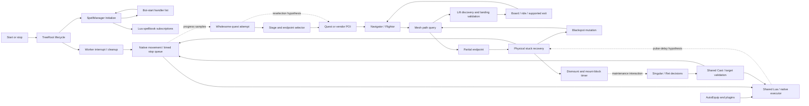

# Directed evidence graph and saved investigation queries

Baseline `63112d57a373c1186cee880f98dab65245a214e1`. This compact, human-reviewed overlay supplements the generated C# syntax graph. An arrow below identifies a source dependency or a candidate feedback relation; it is not automatically a proven runtime cause. Each saved loop is INFERRED until its falsification test is satisfied. There is no claim of complete type binding, runtime discovery, or graph centrality from raw method-name counts.

## Source provenance

All line ranges refer to the baseline above. Full generated JSON edges retain path, line span, source SHA-256, direction, confidence and classification. Unresolved syntax references stay unresolved.

| Owner | Source span |
|---|---|
| Start and spell handler growth | `Styx/Logic/BehaviorTree/TreeRoot.cs:116-144`; `Styx/Logic/Combat/SpellManager.cs:1083-1121` |
| Stop and cleanup | `Styx/Logic/BehaviorTree/TreeRoot.cs:614-696` |
| Generic partial recovery | `Styx/Logic/Pathing/MeshNavigator.cs:875-896` |
| Lift selection and landings | `Styx/Logic/Pathing/MeshNavigator.cs:1611-1765` |
| Boarding state decisions | `Styx/Logic/Pathing/ElevatorTransitController.cs:107-188` |
| Stuck, mount timer, blackspots | `Styx/Logic/Pathing/StuckHandler.cs:1-321` |
| Queued duration movement | `Styx/WoWInternals/WoWMovement.cs:554-558` |
| Quest progress ownership | `runtime-snapshot/Bots/WholesomeAutoQuest-master/WholesomeAutoQuest.cs:1600-1787` |
| Endpoint selection and assessment | `QuestSchedulingPolicy.cs:1-131`; `QuestScheduler.cs:990-1110`, both in the Wholesome folder |
| Ret decisions / shared helper | `runtime-snapshot/Routines/Singular wotlk/ClassSpecific/Paladin/Retribution.cs:65-280`; `Helpers/Spell.cs:255-335` in the same routine |
| Plugin work | `runtime-snapshot/Plugins/AutoEquip2/AutoEquip.cs:61-190` |
| Thunder Bluff witness | `runtime-logs/2026-09-12_1701_45740.log:21758-21980` |

## Saved loops: hypothesis, confidence, and falsification

1. **thunder-bluff** — POI -> path -> partial endpoint -> attempted lift handoff -> stuck -> repeated POI. Confidence 0.4 for the complete causal cycle, not for each observed event. Falsify radius-only attribution with simultaneous live transforms, XY/XYZ distances, both landing samples and a validated competing ramp route. Missing destination geometry is a competing explanation.
2. **mount-buff-recovery** — stuck -> dismount/mount block -> routine maintenance -> movement -> stuck. Confidence 0.4. Hold route and native latency fixed and replay with travel maintenance suppressed; require observed ownership conflicts and reduced stall before calling it causal.
3. **spell-lifecycle** — TreeRoot start -> Initialize -> growing start handler list -> repeated refresh on later starts. Confidence 0.85; source and the 1..13 restart sequence agree. Falsifier: stable invocation-list size and one refresh across 13 reproduced starts. A repair that merely removes/re-adds the handler must still be tested for double refresh ownership.
4. **pulse-latency** — plugin/native work -> delayed movement/progress observation -> stuck/replan -> additional work. Confidence 0.4. Collect all ticks and replay artificial delay. The existing speed-based detector may falsify a latency-only explanation.
5. **blackspot-replan** — stuck -> blackspot mutation -> changed path -> reversal -> stuck. Confidence 0.4. Record blackspot source/version and route revisions. No path change after the relevant mutation falsifies that link; repeated lines alone are insufficient.
6. **lookahead-corner** — path shortcut/look-ahead -> unvalidated segment -> collision/unsupported ground -> recovery -> new path. Confidence 0.4. Replay candidate segments with ground support and collision queries. Do not infer an unsafe accepted segment from skipped-node counts alone.
7. **poi-floor** — endpoint ranking -> wrong/costly floor -> partial path -> repeated endpoint selection. Confidence 0.4. Compare full walk/wait/ride/exit/onward cost and selection history. Preserve the existing partial-path unknown-reachability contract.
8. **movement-ownership** — quest intent -> navigation -> physical recovery -> native commands -> cast/setup -> quest progress. Confidence 0.4. Attach intent/generation/owner IDs and show overlapping contradictory commands before introducing an arbiter. A failure without competing owners falsifies an ownership-only explanation.

## Counter-evidence queries

- **distance-units:** the nearest-object log uses 3D Distance; the elevator gate uses Distance2D and animated location. `WoWObject.cs:203-234`. This contradicts a direct 49.78-versus-35 comparison.
- **timed-movement:** the duration overload already schedules a deadline. The stop stack enters native injection. This contradicts a duration-long-sleep diagnosis.
- **wholesome-ownership:** partial reachability remains unknown, endpoint matching checks height, and transport participates in progress suspension. Preserve these protections.
- **retribution-decisions:** correlate requirements-before-target validation, later target reselection, behavior attributes and historical null-target stacks. Compiler-generated lambda names are not stable cross-build identities.
- **cliff-safety:** board/exit authorization, ground support, selected transport GUID, dock dwell and physical recovery direction must be considered together.

## Repair traceability

B01 -> failing Windows build run 34690526819 -> host snapshot isolation -> stage 02a.
L01 -> latest log's 13-start growth -> lifecycle reproduction -> single refresh owner -> stage 02b.
N03 -> Boarding guard source -> corridor-revocation regression -> stop boarding when safety is lost -> stage 03a.
N01/N02/Q02 -> Thunder Bluff witness and objective-only transport knowledge -> live landing/mesh capture -> typed transitions and route-cost comparison -> stage 03b, currently gated.

The machine-readable exports and offline HTML must retain these uncertainty labels. Test and fixed-by edges may only be marked verified after an actual test run and repair commit; planned work is not a fix.
