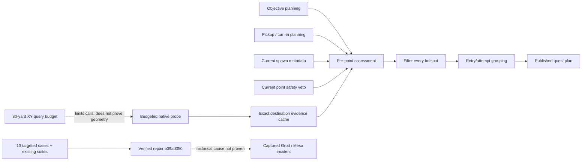

# Quest navigation evidence ownership — Q03

Baseline: `498257b58cb93470ce2c940bbdaab98b908a20d7` (verified checkout-relative quest suites). Repair: `b09ad350a7f283f06b75dd340b6091338c5e2927`. This supplements the inferred POI/floor loop in GRAPH.md; it does not establish that this defect caused the captured Grod incident.

## Source-supported defects and competing explanations

`runtime-snapshot/Bots/WholesomeAutoQuest-master/QuestScheduler.cs`, baseline blob `5dff11d368d2a458030004c9026d5d15495872fd`:

- `EndpointKey`, lines 346–357, groups retries into 80-yard XY cells. `CreateCachedNavigationAssessment`, lines 949–998, reused that key for combined safety, reachability and record score. Different positions and floors could borrow a result, while an identical position could borrow another record's metadata.
- Both `AddObjectiveWork` and `AddRelationWork` assessed only `cluster.Value[0]`, then published every cluster hotspot. Replacing only the dictionary key would therefore leave unsafe later hotspots unassessed.
- The unsafe-query catch assigned `knownSafe = null`, erasing an already established false result. Missing evidence must not erase a veto.

Counterevidence retained: coarse cells serve an intentional path-query/attempt budget; a per-spawn native query would multiply synchronous work. Unknown reachability is already permitted for bounded execution probes. Partial mesh paths remain unknown, not automatically unreachable. These contracts were preserved rather than using this repair to fabricate lift geometry or quarantine valid quest data.

## Repair

Coarse keys now own the retry/query budget, never spatial proof. Raw live evidence is cached by exact map/X/Y/Z; current-record metadata and cheap unsafe-point checks are applied independently. There is at most one new native path probe per original coarse cell per scan. Other unprobed positions remain unknown. Explicit negative evidence bypasses unnecessary path queries, and provider failures are memoized for the scan.

Every in-range candidate hotspot is assessed and filtered before objective or relation grouping. Representatives are ranked by their own evidence, with confirmed candidates preceding unknown alternatives. Production ScanAndRefresh passes the cheap BlackspotManager veto separately so non-probed points still receive safety checks. Existing five-cell attempt limits, stage ownership, non-quarantining 30-second navigation retry, and persistent recovery-key encoding are unchanged.

Verified source blob: `8193398e7a16a51126388131e72a8bdd1e963e5b`; SHA-256 `a2d9bb2cf0e916febb3ff1f019e40ad4953b9c050c3c07f9237030e8013e1cc0`.

## Actual validation history

1. Test-first commit `6da3e5eb0227a8d56402e4f404b99bba8af339a8`, run **34695244750**: Wholesome built successfully; **10 of 13 new scenarios failed**. Query-budget, map-identity and provider-failure controls passed. Private artifact 10298468016, SHA-256 `47aa12abd232002edf1996c2a8699b3fff36683a13179cd4458efb267e343a73`.
2. First patch preflight, run **34695742709**: all 13 new cases passed, but the existing all-paths-rejected fixture failed. This failure was investigated, not ignored. Its extra same-cell point had never received a path probe; it was wrongly being treated as already rejected. Two existing all-rejected fixtures now explicitly contain one destination per query-budget cell. All rejection, omission, bounded-retry and no-quarantine assertions remain. The live-enrichment fixture now supplies the same cheap veto used by production; expected native calls decrease from seven to five because explicitly unsafe points need no path query.
3. Exact-patch preflight, run **34696052640** at `aead775464aa30f908031c50b16f3c5c877abe2b`: build 0, execution 0; **13/13 new cases plus the full existing Wholesome suite passed**. Both postimage blobs were hash-verified before promotion. Artifact 10298836421, SHA-256 `8153ce70ed611bface9aa8d8adecac07038400db026a89bcd0341b86262ffbd1`.
4. Committed repair `b09ad350a7f283f06b75dd340b6091338c5e2927`, run **34696245169**: build/run exit 0 for QuestRecovery, WholesomeQuestRecovery, QuestRecoveryAdapter, QuestPickupPolicy, VendorCore and explicit RoutineCompatibility. The 13 new cases passed again, and **98 tracked Singular files compiled**. Complete artifact 10299071323 was downloaded and inspected; SHA-256 `d0a74f8be12402603d400196c8bd4963764fe856a85f95a68f892bf49673a182`. The verified x86 runtime/framework version was 10.0.12. Independent host-build workflow **34696245158** also passed at the same commit.

All listed runs report no game attached. The temporary patch/blob preflight workflow and patch were removed when the verified production blobs were committed; no persistent write-token workflow is introduced by this PR. No test was deleted. No raw runtime log, binary or mesh asset is added.

## Directed graph

`QUEST_NAVIGATION_GRAPH.json` is an explicit continuation overlay with source and artifact provenance, not a replacement for the whole-codebase syntax/semantic graph. Extracted control/data-flow, reproduced failure and uncertain historical-cause edges are distinguished.

## Remaining gates and rollback

Persistent 80-yard XY recovery scopes remain coarser than floor-aware topology. Mesa discovery, supported board/exit geometry, total approach/wait/ride/onward cost, native-query wall time and in-game route success remain open. More alternates can correctly survive as unknown; bounded execution and support checks still require live acceptance before deployment. This is not a claim of globally optimal routing or all 4,335 quests passing.

Rollback the focused scheduler change as a reviewed revert, preserving the regression/history and restoring matching fixture expectations only with explicit evidence. No automatic merge or deployment was performed; independent review and live acceptance remain pending.
